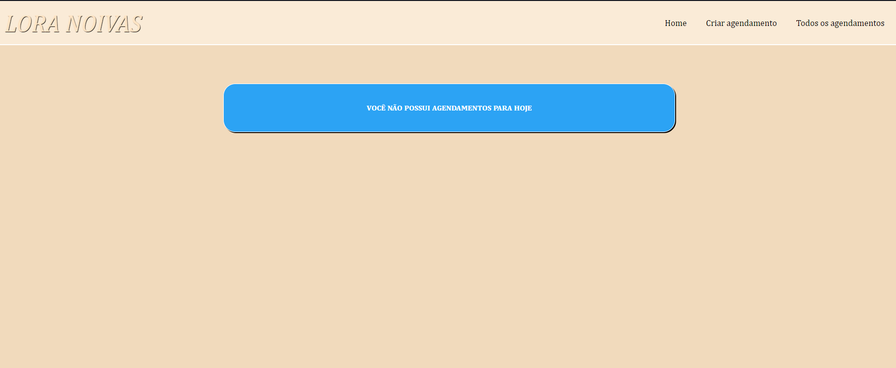
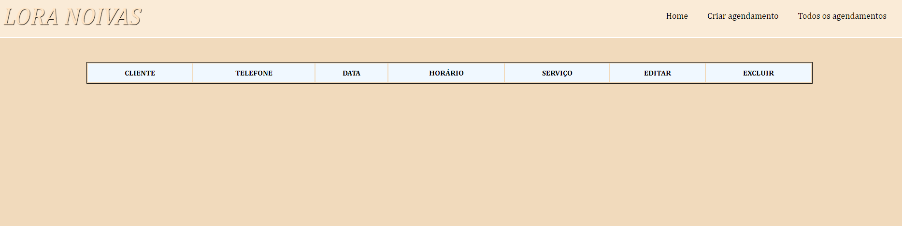

# Agenda-PHP
 Projeto open-source desktop (não responsivo, por falta de necessidade) desenvolvido para sanar a necessidade de uma agenda virtual para uma MEI  que por motivos de saúde necessitava de um sistema de controle que não dependesse de cadernos/agendas físicas. 
 
#Tecnologias utilizadas:

* HTML5
* CSS3
* JS - JQuery 
* PHP 8
* SQL - MySQL
 
# Descrição:

 * 1- Quando não houver nenhum agendamento para o dia vigente, uma será exibida uma mensagem informando essa situação:

* 2- Ao acessar a página de criar agendamento, haverá um formulário simples a ser preenchido, possuindo máscaras e validações criadas por meio de JS/JQuery:

* 3- Acessando a página de todos os agendamentos, caso nõa existam agendamentos cadastrados será exibida apenas uma tabela vazia:

* 4- Após cadastrar algum registro na agenda, a página home exibirá os agendamentos que estão previstos para o dia (em vermelho) e os que estão previstos para a semana (em amarelo)

Além disso, será gerada uma mensagemd de confirmação caso o agendamento seja realizado com sucesso.

* 5- Após cadastrar algum registro na agenda, a página de todos os registros exibirá a totalidade de registros, aplicando cores para cada um de acordo com a data (vermelho = dia atual, amarelo = semana atual, verde = próximas semanas). 

Além disso, poderão ser acessadas as páginas de edição de agendamento e de exclusão de agendamento.

* 6 - Na página de edição será exibido um formulário pré preenchido com as informações do agendamento que poderá ser alterado e salvo em seguida. Esse formulário possui as mesmas validações do de cadastros e gerará uma mensagem caso o registro seja alterado com sucesso. 

* 7 - Por fim, a página de exclusão apresentará um resumo do registro a ser excluído, com aviso e opção de confirmação. Caso o usuário decida excluir será realizada a exclusão, gerando uma mensagem de aviso. Caso decida não excluir, será gerada uma mensagem informando que o agendamento foi mantido. 

